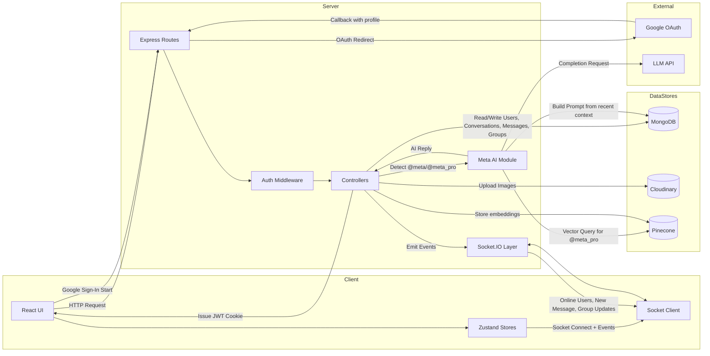

# Data Flow Diagram

## Notes

- `@meta` uses recent conversation/group context from MongoDB.
- `@meta_pro` uses the same context plus Pinecone vector retrieval.
- AI replies are persisted as normal messages and delivered through Socket.IO.
- Google OAuth callback finalizes login by issuing the same JWT cookie strategy used by regular login.
